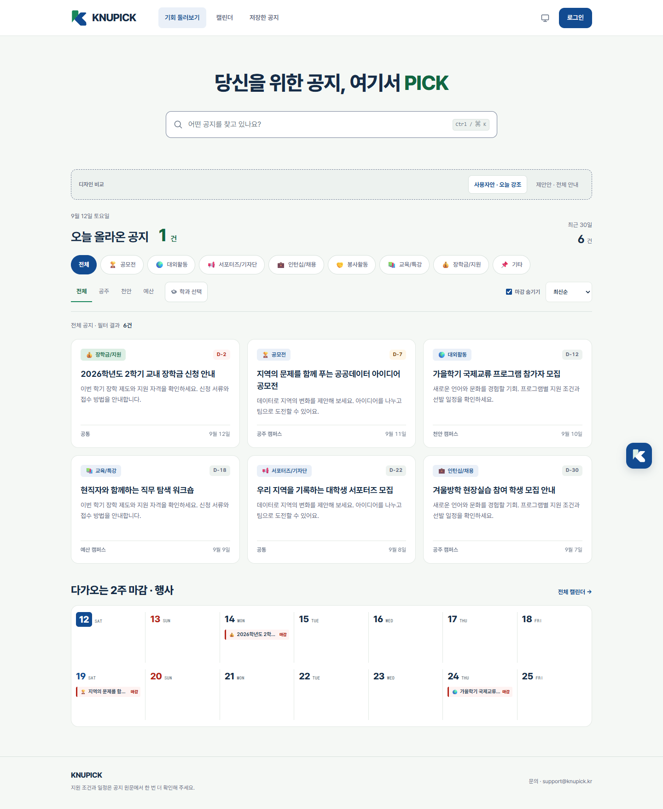

# KNUPICK B 브랜드

2026-09-12 사용자 확정안. 공주대학교 컬러에서 출발한 블루·그린을 사용하며, 두 조각 K/책갈피 심볼과 KNUPICK 워드마크를 적용한다.

- 중심 카피: **당신을 위한 공지, 여기서 PICK**. 검색창과 함께 가운데 정렬한다.
- 2026-09-13: ‘공지’ 자리를 세로 슬롯으로 바꿨다. 공지 → 공모전 → 대외활동 → 인턴십 → 봉사활동 → 교육 → 장학금 순서로 3초마다 내려온다. 2.4초 유지 후 0.6초 동안 전환하며, 고정 폭으로 제목과 검색창의 위치를 유지한다. `prefers-reduced-motion`에서는 ‘공지’로 고정하고 스크린리더에 반복 변경을 알리지 않는다. 추가 라이브러리나 타이머 없이 CSS transform으로 구현했다.
- 공지 영역: 날짜와 **오늘 올라온 공지 N건**을 왼쪽에, **최근 30일 N건**을 오른쪽에 표시한다.
- 최근 30일은 한국 날짜 기준 오늘과 이전 29일의 원문 게시일을 포함한다. 미래 날짜와 게시일이 없는 공지는 제외한다. 필터 결과 수는 별도 표시한다.
- 오늘 건수를 누르면 오늘 게시된 공지만 조회한다. 0건과 집계 실패를 구분하고, 실패 시 재시도를 제공한다.
- 캠퍼스는 `공통`, `공주 캠퍼스`, `천안 캠퍼스`, `예산 캠퍼스`로 표시한다. 이니셜 원형 배지는 사용하지 않는다. 활동 유형은 기존 카테고리 이모지를 사용한다.
- 기본 홈에는 디자인 비교 버튼이 없다. 기록 확인용 `?compare=notices&noticeView=overview`에서만 제안안을 볼 수 있다.

| 용도 | 색상 |
| --- | --- |
| Blue | `#124B91` |
| Green | `#17865B` |
| Ink | `#162C47` |
| Paper | `#F5F8F5` |
| Mint | `#DDEFE4` |

의미별 라이트·다크 토큰과 반응형 규칙은 `src/app/globals.css`, 심볼 형상은 `src/lib/brand.ts`, React 심볼은 `src/components/BrandMark.tsx`에서 관리한다. 아이콘 내보내기는 `scripts/export-brand-assets.ts`를 사용한다. `--accent`는 글자·링크, `--action`은 흰 글자가 올라가는 채움 버튼에 사용한다.

[모바일 화면](notice-user-mobile.png). 캡처의 공지 6건은 검토용 데이터이며 디자인 비교 도구가 열린 상태다. 운영 화면은 실제 API 집계값을 사용한다.

[배포 범위와 검증](../releases/brand-b-v1.md)
